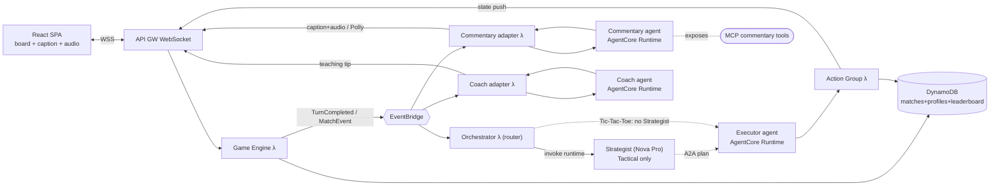

# Human vs. AI Multi-Agent Gaming Platform

Event-driven, serverless turn-based game platform. Humans play against specialist
AI agents deployed on **Amazon Bedrock AgentCore Runtime**. The default models are
**Amazon Nova**, but each difficulty tier can be remapped to another Bedrock model
(for example Claude) through environment variables. The platform includes
opponent-memory profiles, a Strategist/Executor split for Tactical Arena, and a
live AI commentator and coach (text + emotional Polly audio) reusable over **MCP**.

Games: **Tic-Tac-Toe** and **Tactical Arena** (8×8 squad combat), with difficulty-
tiered model selection. See [DOCUMENTATION.md](docs/DOCUMENTATION.md) for full details.

## Architecture



## Repo layout

| Path | What |
|------|------|
| `template.yaml` | AWS SAM stack (DynamoDB, WebSocket API, EventBridge, Lambdas) |
| `backend/common/` | Shared Python: db, ws, connect, disconnect, orchestrator, profile |
| `backend/commentary/` | Commentary runtime entrypoint + Lambda adapter + Polly voice + MCP server |
| `backend/coach/` | Coach runtime entrypoint + Lambda adapter |
| `backend/tictactoe/` | Tic-tac-toe: rules, engine, agent, action group (all Python) |
| `backend/tactical/` | Tactical Arena: rules, Strategist/Executor agent, action group |
| `frontend/src/{common,tictactoe,tactical}/` | React: shared hook + caption + per-game UIs |

## Quick start

```powershell
# backend (all Python)
sam build; sam deploy --guided
# agent runtimes (set ACTION_GROUP_FUNCTION before launching each runtime)
cd backend/tictactoe; pip install -r requirements.txt
cd ../tactical; pip install -r requirements.txt
cd ../commentary; pip install -r requirements.txt
cd ../coach; pip install -r requirements.txt
# frontend
cd ../../frontend; npm install; npm run dev
```

## Deploy AgentCore runtimes

Each game agent runs from its own folder. Before launching, set the action-group
Lambda name printed by SAM in `TicTacToeActionFn` or `TacticalActionFn`.

```powershell
pip install bedrock-agentcore-starter-toolkit

# Tic-Tac-Toe runtime
cd backend/tictactoe
$env:ACTION_GROUP_FUNCTION = "<TicTacToeActionFn name from SAM output>"
agentcore configure --entrypoint agent.py
agentcore launch

# Tactical runtime
cd ../tactical
$env:ACTION_GROUP_FUNCTION = "<TacticalActionFn name from SAM output>"
agentcore configure --entrypoint agent.py
agentcore launch

# Commentary runtime
cd ../commentary
agentcore configure --entrypoint commentary.py
agentcore launch

# Coach runtime
cd ../coach
agentcore configure --entrypoint coach.py
agentcore launch
```

Then deploy the SAM stack with the printed runtime ARNs:

```powershell
sam deploy --parameter-overrides `
  AgentRuntimeArn=<ttt-arn> `
  TacticalAgentArn=<tactical-arn> `
  CommentaryRuntimeArn=<commentary-arn> `
  CoachRuntimeArn=<coach-arn>
```

## Model configuration

By default, Tic-Tac-Toe and Tactical use Nova model IDs, but the runtime can be
repointed per difficulty tier without code changes.

| Runtime | Easy | Medium | Hard |
|---------|------|--------|------|
| Tic-Tac-Toe | `TICTACTOE_EASY_MODEL_ID` | `TICTACTOE_MEDIUM_MODEL_ID` | `TICTACTOE_HARD_MODEL_ID` |
| Tactical | `TACTICAL_EASY_MODEL_ID` | `TACTICAL_MEDIUM_MODEL_ID` | `TACTICAL_HARD_MODEL_ID` |

For Tactical, the strategist can also be changed with `TACTICAL_STRATEGIST_MODEL_ID`.

Example Claude values:

```powershell
$env:TICTACTOE_EASY_MODEL_ID = "anthropic.claude-3-5-sonnet-20241022-v2:0"
$env:TICTACTOE_MEDIUM_MODEL_ID = "anthropic.claude-3-5-sonnet-20241022-v2:0"
$env:TICTACTOE_HARD_MODEL_ID = "anthropic.claude-3-5-sonnet-20241022-v2:0"
```

Set the variables before `agentcore launch`, then relaunch the runtime after any change.

## Local files

The repo ignores local build/runtime state such as `.aws-sam/`, `.venv/`,
`node_modules/`, `.env*`, and `backend/**/.bedrock_agentcore.yaml`, so those
machine-specific files do not need to be checked in.

## Model map

| Use | Model | Reason |
|------|-------|--------|
| Tic-Tac-Toe (easy/med/hard) | Nova Micro/Lite/Pro | difficulty-tiered |
| Tactical (easy/med/hard) | Nova Lite/Micro/Pro | difficulty-tiered |
| Strategist (A2A) | Nova Pro | battle planning |
| Commentary | Nova Micro + Polly | fast emotional calls |
| Logic Riddles (future) | Nova Pro | deep text reasoning |
