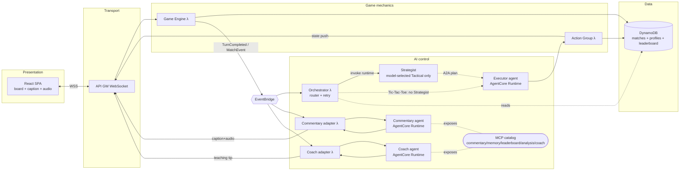
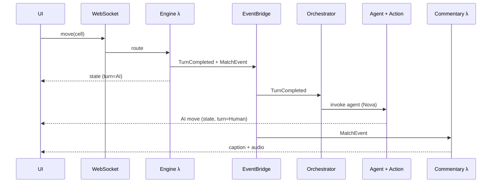
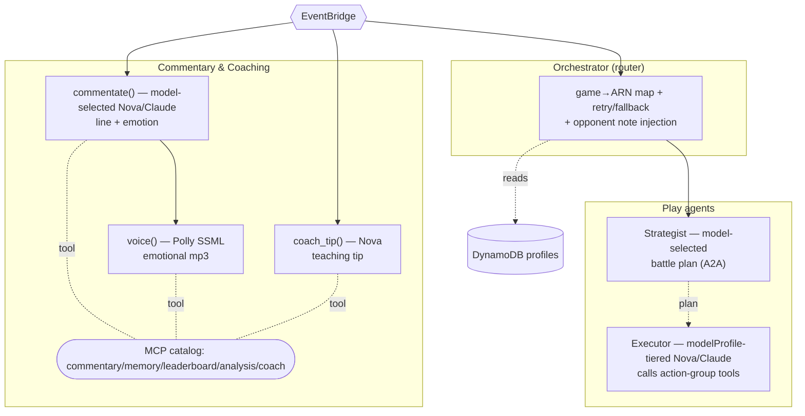

# Human vs. AI Multi-Agent Gaming Platform — Technical Documentation

## Table of Contents
1. [Overview](#1-overview)
2. [Architecture](#2-architecture)
3. [Tech Stack](#3-tech-stack)
4. [Workflow](#4-workflow)
5. [Project Structure](#5-project-structure)
6. [Setup and Run to Play](#6-setup-and-run-to-play)
7. [Data Model](#7-data-model)
8. [Tactical Arena (second game)](#8-tactical-arena-second-game)
8a. [AI Layers (multi-agent, commentary, MCP, memory)](#8a-ai-layers-multi-agent-commentary-mcp-memory)
9. [Extending to New Games](#9-extending-to-new-games)
10. [Cost, Security & Operations](#10-cost-security--operations)

---

## 1. Overview

An event-driven, fully serverless platform where humans play turn-based games
against specialist AI agents. Each agent runs on **Amazon Bedrock AgentCore
Runtime** and can reason with **Amazon Nova** or **Claude** models. Game mechanics
are deterministic and live in code; AI decision-making is isolated behind an
asynchronous boundary so player connections never hang while the model thinks.

Claude uses Bedrock inference profile IDs or ARNs, not plain on-demand model IDs.
The repo defaults use profile-style IDs such as `us.*` and `global.*`, but if
your account or region differs, replace them with the exact profile from the
Bedrock console.

- **First game:** Tic-Tac-Toe (six profiles: easy/medium/hard × Amazon/Claude)
- **Second game:** Tactical Arena — 8×8 squad combat (Tank/Striker/Support), same six-profile selector
- **Multi-agent AI:** Strategist/Executor (A2A) split, a teaching **Coach agent**, opponent-memory profiles, and a live AI commentator (text + emotional Polly audio)
- **Shared MCP catalog:** commentary, memory, leaderboard, board-analysis, and coaching tools any agent can discover and reuse
- **Pattern:** the board is reduced to a semantic array `M ∈ {0,1,-1}^{3×3}` (1=Human, -1=AI, 0=empty) to minimize tokens
- **Roadmap:** Chess/Poker, Logic Riddles

## 2. Architecture



The frontend connection is freed the moment a move is accepted. AI work (move,
commentary, coaching) happens async via EventBridge, and results are pushed back over
the same WebSocket. Reusable capabilities are exposed via a shared **MCP catalog**, so
future games and agents discover them unchanged.

## 3. Tech Stack

| Layer | Service | Purpose |
|-------|---------|---------|
| Presentation | React + Amplify Hosting | Single-page board UI on CloudFront edge |
| Transport | API Gateway (WebSocket) | Persistent duplex connection, move routing |
| Game mechanics | AWS Lambda (Python) | Validate moves, enforce rules |
| Database | DynamoDB (single-table) | Matches, moves, connections |
| Event bus | EventBridge | `TurnCompleted` decouples UI from AI |
| AI control | Bedrock AgentCore Runtime | Hosts isolated agent sessions |
| Inference | Amazon Nova / Claude | Fast tactical move selection with six selectable profiles |
| Multi-agent | Strategist + Executor (A2A) | Selected model profile plans, executor moves |
| Coach runtime | AgentCore Runtime + Nova | Generates teaching tips |
| Coach adapter | AWS Lambda | EventBridge trigger + WS push |
| Commentary runtime | AgentCore Runtime + Nova | Generates line + emotion |
| Commentary adapter | AWS Lambda + Polly | EventBridge trigger + speech + WS push |
| Analysis | Heuristic engine | Model-free threat/opportunity read |
| Tool reuse | Shared MCP catalog | Commentary, memory, leaderboard, analysis, coaching shared across agents |
| Memory | DynamoDB profiles | Adaptive per-player AI |
| Action tools | AWS Lambda (Python) | Agent writes move + pushes state |
| IaC | AWS SAM | One-command deploy |

## 4. Workflow

1. **Human move** — UI sends `{action:"move", matchId, cell}` over the WebSocket.
2. **Rule enforcement** — Game Engine validates the cell, mutates the board, writes
   DynamoDB, sets `currentTurn=AI`, returns immediately.
3. **Async break** — emits `TurnCompleted` to EventBridge; UI shows "AI thinking…".
4. **Routing** — Orchestrator maps `gameId → AgentCore runtime ARN` and invokes it
   with the board state.
5. **Inference** — the selected `modelProfile` picks the matching model and the agent returns one JSON move.
6. **Action** — Action Group Lambda writes the move, sets `currentTurn=Human`,
   pushes new state over WebSocket. Board unlocks.
7. **Commentary** — each move emits `MatchEvent`; the Commentary adapter Lambda invokes
  the Commentary AgentCore runtime for `{line, emotion}`, Polly synthesizes audio,
  and both stream to the UI caption.
8. **Coaching** — the same `MatchEvent` triggers the Coach adapter Lambda; on the
  human's own moves it invokes the Coach AgentCore runtime for one constructive tip
  and pushes it to the UI.

### End-to-end walkthrough (one Tic-Tac-Toe move)

Components in the exact order they fire for a single human move:

1. **React SPA** — [useGame.ts](../frontend/src/common/useGame.ts): click a cell → sends `{action:"move", matchId, cell, username, difficulty}` over the open WebSocket and keeps listening.
2. **API GW WebSocket** — [template.yaml](../template.yaml) `move` route forwards to the engine; the duplex socket lets the AI reply return later.
3. **Game Engine λ** — [tictactoe/engine.py](../backend/tictactoe/engine.py): loads/creates match, validates cell, writes DynamoDB, sets `currentTurn=AI`, returns immediately (UI never hangs).
4. **Opponent memory** — [profile.py](../backend/common/profile.py): `note_move` records your move under `PROFILE#<username>` for cross-match adaptation.
5. **EventBridge** — engine emits `TurnCompleted` (wake AI) + `MatchEvent` (commentary); this async boundary frees the connection.
6. **Orchestrator λ (router)** — [orchestrator.py](../backend/common/orchestrator.py): maps `tictactoe→ARN`, adds opponent note, forwards the selected `modelProfile`, invokes AgentCore with 3× retry/fallback.
7. **Executor agent** — [tictactoe/agent.py](../backend/tictactoe/agent.py): resolves the selected profile to Nova or Claude and emits one JSON move. (Tactical first runs a model-selected **Strategist** → A2A → executor.)
8. **Action Group λ** — [action_group.py](../backend/tictactoe/action_group.py): writes AI move, sets `currentTurn=Human`, pushes state, records result, emits a `MatchEvent`.
9. **Commentary adapter λ** — [handler.py](../backend/commentary/handler.py): invokes Commentary AgentCore runtime ([commentary.py](../backend/commentary/commentary.py)) for line+emotion, then Polly audio ([voice.py](../backend/commentary/voice.py)) is pushed to UI; same function exposed via the shared [mcp_catalog.py](../backend/mcp_catalog.py).
10. **Coach adapter λ** — [coach/handler.py](../backend/coach/handler.py): on the human's own move, invokes Coach AgentCore runtime ([coach.py](../backend/coach/coach.py)) and pushes one teaching tip to the UI; same function exposed via the catalog as `explain_move`.
11. **UI** — board unlocks; caption shows and emotional audio auto-plays, and the coach tip appears below.



## 5. Project Structure

Folders are organized **per game** so each game's agent, rules, and tool Lambda
live together. Shared infrastructure lives in `common/`.

```
aws-ai-agentcore-game-platform/
│
├── README.md                          # Project summary & quick start
├── DOCUMENTATION.md                   # This file
├── template.yaml                      # AWS SAM stack: DynamoDB, WS API, EventBridge, Lambdas
│
├── backend/                           # All Python (python3.11)
│   ├── requirements.txt               # Lambda deps (boto3 only)
│   ├── mcp_catalog.py                 # Shared MCP catalog: commentary/memory/leaderboard/analysis/coach
│   ├── common/                        # Shared, used by every game
│   │   ├── db.py                      # DynamoDB + EventBridge clients, key helpers
│   │   ├── ws.py                      # WebSocket push helper
│   │   ├── connect.py                 # $connect handler
│   │   ├── disconnect.py              # $disconnect handler
│   │   ├── profile.py                 # Opponent memory profiles (adaptive AI)
│   │   ├── analysis.py                # Model-free board analysis (threats/opportunities)
│   │   ├── leaderboard.py             # Record results + top-N query
│   │   └── orchestrator.py            # EventBridge → AgentCore invoke (router + retry/fallback)
│   ├── commentary/                    # Live AI commentary (text + emotional audio)
│   │   ├── commentary.py              # Commentary AgentCore runtime entrypoint (Strands+Nova)
│   │   ├── voice.py                   # Polly emotional TTS (SSML prosody, base64 mp3)
│   │   ├── handler.py                 # EventBridge adapter: invoke runtime → Polly → WS push
│   │   ├── requirements.txt           # Commentary runtime deps
│   │   └── mcp_server.py              # Commentary-only MCP server (legacy/standalone)
│   ├── coach/                         # Teaching A2A role (pure event consumer)
│   │   ├── coach.py                   # Coach AgentCore runtime entrypoint (Strands+Nova)
│   │   ├── handler.py                 # EventBridge adapter: invoke runtime → WS push
│   │   └── requirements.txt           # Coach runtime deps
│   ├── tictactoe/
│   │   ├── rules.py                   # Apply move, evaluate winner (M∈{0,1,-1})
│   │   ├── engine.py                  # Game engine λ: validate move, emit TurnCompleted
│   │   ├── agent.py                   # Strands agent (Nova/Claude selectable) for AgentCore Runtime
│   │   ├── action_group.py            # Writes AI move, pushes state
│   │   └── requirements.txt           # Agent deps
│   └── tactical/
│       ├── rules.py                   # 8×8 units, distance, winner
│       ├── agent.py                   # Strands agent (Nova/Claude selectable, strategist + executor)
│       ├── action_group.py            # Validates/applies squad orders, pushes state
│       └── requirements.txt           # Agent deps
│
└── frontend/                          # React + Vite (hosted on Amplify)
    ├── package.json
    ├── vite.config.ts
    ├── index.html
    └── src/
        ├── main.tsx                   # React entry
        ├── App.tsx                    # Game selector
        ├── common/{types.ts,useGame.ts,Commentary.tsx,Coach.tsx,Leaderboard.tsx}
        ├── tictactoe/TicTacToe.tsx    # 3×3 board UI
        └── tactical/TacticalArena.tsx # 8×8 arena UI
```

## 6. Setup and Run to Play

**Prerequisites:** Node 20+, Python 3.11, AWS SAM CLI, AWS creds, Bedrock Nova/Claude + AgentCore access.

Build note: SAM packages Lambda code from `backend/requirements.txt` (boto3 only),
so native `sam build` works on Windows without Docker. Agent-only dependencies
(`strands-agents`, `bedrock-agentcore`) live in per-runtime requirements files under
`backend/tictactoe`, `backend/tactical`, `backend/commentary`, and `backend/coach`.

```powershell
# 1. Backend deploy
sam build; sam deploy --guided   # note WebSocketUrl + TicTacToeActionFn/TacticalActionFn outputs

# 2. Agents (deploy each game's agent to AgentCore Runtime)
cd backend/tictactoe; pip install -r requirements.txt bedrock-agentcore-starter-toolkit
$env:ACTION_GROUP_FUNCTION = "<TicTacToeActionFn name>"
agentcore configure --entrypoint agent.py; agentcore launch   # prints AgentRuntimeArn
cd ../tactical; $env:ACTION_GROUP_FUNCTION = "<TacticalActionFn name>"
agentcore configure --entrypoint agent.py; agentcore launch   # prints tactical ARN

# 3. Commentary + Coach AgentCore runtimes
cd ../commentary; pip install -r requirements.txt
agentcore configure --entrypoint commentary.py; agentcore launch   # prints commentary ARN
cd ../coach; pip install -r requirements.txt
agentcore configure --entrypoint coach.py; agentcore launch       # prints coach ARN

# 4. Wire ARNs back into the stack
cd ../..; sam deploy --parameter-overrides AgentRuntimeArn=<ttt> TacticalAgentArn=<tac> CommentaryRuntimeArn=<commentary> CoachRuntimeArn=<coach>

# 5. Frontend
cd frontend; npm install
$env:VITE_WS_URL = "<WebSocketUrl>"; npm run dev
```

The **Commentary** and **Coach** adapter Lambdas deploy with the stack and wake
automatically on `MatchEvent`; they call the corresponding AgentCore runtime ARNs.
For the play agents, set the model env vars that correspond to the six frontend
options before `agentcore launch`.

| Frontend option | Tic-Tac-Toe env var | Tactical env var |
|---|---|---|
| `easy_amazon` | `TICTACTOE_EASY_AMAZON_MODEL_ID` | `TACTICAL_EASY_AMAZON_MODEL_ID` |
| `easy_claude` | `TICTACTOE_EASY_CLAUDE_MODEL_ID` | `TACTICAL_EASY_CLAUDE_MODEL_ID` |
| `medium_amazon` | `TICTACTOE_MEDIUM_AMAZON_MODEL_ID` | `TACTICAL_MEDIUM_AMAZON_MODEL_ID` |
| `medium_claude` | `TICTACTOE_MEDIUM_CLAUDE_MODEL_ID` | `TACTICAL_MEDIUM_CLAUDE_MODEL_ID` |
| `hard_amazon` | `TICTACTOE_HARD_AMAZON_MODEL_ID` | `TACTICAL_HARD_AMAZON_MODEL_ID` |
| `hard_claude` | `TICTACTOE_HARD_CLAUDE_MODEL_ID` | `TACTICAL_HARD_CLAUDE_MODEL_ID` |
To expose reusable capabilities to other agents over MCP, run the shared catalog
locally (stdio transport):

```powershell
cd backend; python -m mcp_catalog   # tools: generate_commentary, speak, recall_player, top_players, analyze_position, explain_move
```

Open the dev server, click **New game**, choose one of the six model profiles, and play X against the selected AI.

## 7. Data Model

Single-table DynamoDB:

| Item | PK | SK |
|------|----|----|
| Match | `MATCH#<id>` | `META` |
| Connection | `CONN#<id>` | `META` |
| Move history | `MATCH#<id>` | `MOVE#<iso>` |
| Leaderboard | `LEADER#<game>#<difficulty>` | `USER#<username>` |
| Opponent profile | `PROFILE#<username>` | `GAME#<game>` |

Leaderboard rows carry `wins/losses/draws/games/score` and GSI keys (`GSI1PK=LEADER#<game>#<difficulty>`, `GSI1SK=score`). The **Leaderboard** GSI returns top-N players sorted by score (win=3, draw=1, loss=0). Username + difficulty (easy/medium/hard) are chosen per match; login comes later.

`currentTurn` flips Human↔AI; the AI never moves while it's the human's turn.

## 8. Tactical Arena (second game)

8×8 grid squad combat: each side fields **Tank** (HP140), **Striker** (HP90), **Support** (HP80). Movement & attack use Manhattan distance; damage = `max(1, attacker.atk − defender.def)`. Win by eliminating all enemy units. Same flow as tic-tac-toe — only the rules module and agent differ:

- Rules: [backend/tactical/rules.py](backend/tactical/rules.py) (units, distance, winner)
- Agent: [backend/tactical/agent.py](backend/tactical/agent.py) — issues one `unit_action` (move/attack) per living AI unit
- Action Group [backend/tactical/action_group.py](backend/tactical/action_group.py) validates and applies each order

The six frontend options select Nova or Claude per match. Override each tier with
the matching env var, and use Bedrock inference profile IDs for Claude:

| Frontend option | Tic-Tac-Toe | Tactical |
|------|-----------|----------|
| easy_amazon | `amazon.nova-micro-v1:0` | `amazon.nova-lite-v1:0` |
| easy_claude | `us.anthropic.claude-haiku-4-5-20251001-v1:0` | `us.anthropic.claude-haiku-4-5-20251001-v1:0` |
| medium_amazon | `amazon.nova-lite-v1:0` | `amazon.nova-micro-v1:0` |
| medium_claude | `global.anthropic.claude-sonnet-4-6` | `global.anthropic.claude-sonnet-4-6` |
| hard_amazon | `amazon.nova-pro-v1:0` | `amazon.nova-pro-v1:0` |
| hard_claude | `global.anthropic.claude-opus-4-7` | `global.anthropic.claude-opus-4-7` |

Selected `modelProfile` flows engine → orchestrator payload → agent, which builds the matching model per request.

## 8a. AI Layers (multi-agent, commentary, MCP, memory)



- **Router orchestrator** — [orchestrator.py](../backend/common/orchestrator.py): deterministic game→agent map, 3× retry with fallback, injects opponent memory.
- **A2A (Strategist/Executor)** — [tactical/agent.py](../backend/tactical/agent.py): model-selected Strategist sets intent, executor issues moves.
- **Coach (teaching A2A role)** — [coach/coach.py](../backend/coach/coach.py): a pure event consumer that never plays a move; it watches `MatchEvent` and returns one constructive tip on the human's own moves.
- **Commentary** — [commentary/commentary.py](../backend/commentary/commentary.py) + [voice.py](../backend/commentary/voice.py): emotional caption + Polly audio per move.
- **Board analysis** — [common/analysis.py](../backend/common/analysis.py): model-free heuristics returning immediate threats/opportunities and a one-line read.
- **Shared MCP catalog** — [mcp_catalog.py](../backend/mcp_catalog.py): one `game-platform` server exposing `generate_commentary`, `speak`, `commentate_and_speak`, `recall_player`, `top_players`, `analyze_position`, and `explain_move`. The same functions back the EventBridge handlers, so behavior is identical whether a capability is fired by the platform or pulled by an agent.
- **Memory** — [common/profile.py](../backend/common/profile.py): per-player profiles make the AI adapt across matches.

## 9. Extending to New Games

1. Add the game to `GameId` and a rules module beside `game.ts`.
2. Build a new agent under `agent/` (selectable model profile for tactical, reasoning models for harder games).
3. Register its runtime ARN in the orchestrator `AGENT_RUNTIME` map.
4. Reuse the same WebSocket, EventBridge, action-group, **commentary, coaching, and memory** pattern — these fire on `MatchEvent` and need no per-game code.
5. (Optional) add a board analyzer in [analysis.py](../backend/common/analysis.py) so the new game gains `analyze_position` in the MCP catalog.

## 10. Cost, Security & Operations

- **Pay-per-use:** DynamoDB on-demand, Lambda, AgentCore, Nova, Polly — no idle cost.
- **Server-side validation:** rules enforced in Lambda; clients can't tamper.
- **Isolation:** each match is an isolated AgentCore session keyed by `matchId`.
- **Decoupled commentary:** runs async on `MatchEvent`, never blocks moves; audio is base64 over the existing WebSocket.
- **Decoupled coaching:** the Coach Lambda has its own `MatchEvent` rule, so a coaching failure never affects the game or commentary.
- **Observability:** X-Ray tracing on, plus AgentCore OTEL traces.
